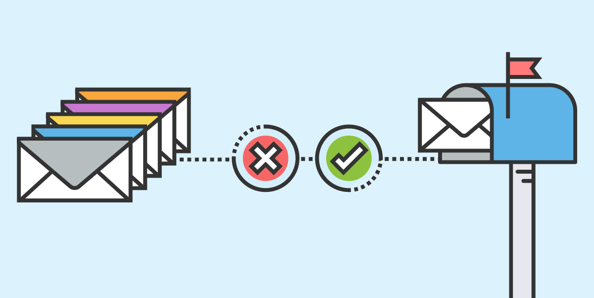

# Naive-Bayes Based Spam/ham Email Classifier

## About
This Classifier predicts if a given mail is Spam or Ham. It's a Supervised Learning task where the Model is first trained by "showing" it a set of spam ans non-spam emails

### Naive-Bayes Classifier

* They work by correlating the use of certain words with spam and non-spam emails.
* Then using Bayes theorem, Probability is calculated if the mail is Spam or not.

* Some phrases have "higher probabilities" of occuring in Spam mails than others. Ex: "Free","Discount","You have won","Click to see if you have won" ..

# Main Script

* [main.py](main.py)

## Built With

* Python

