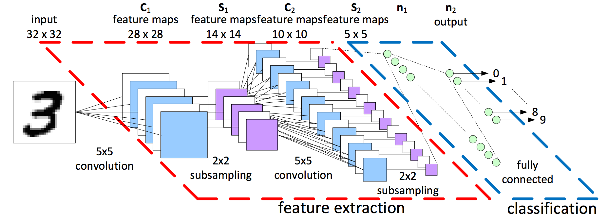

# A Convolutional Neural Network based Image classifier

This is an image-classifier which identifies dogs and cats built using TensorFlow. 

It is based on the model of Convolutional Neural Networks.

## Why is it called Convolutional?

The first layers of the Neural Network that receive an input signal are called convolution filters. Convolution is a process where the network tries to label the input signal by referring to what it has learned in the past. If the input signal looks like previous cat images it has seen before, the “cat” reference signal will be mixed into, or convolved with, the input signal. The resulting output signal is then passed on to the next layer.

# Accuracy achieved using this model : 81%.

If you want to see the model in action(training) : https://youtu.be/AUxc8GdrL5U 

Find the code in -  [model.py](model.py)
